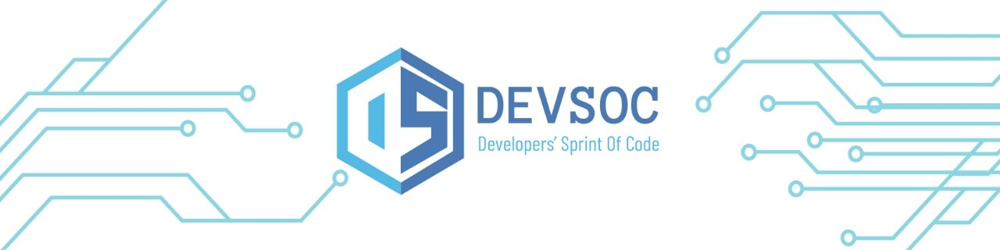
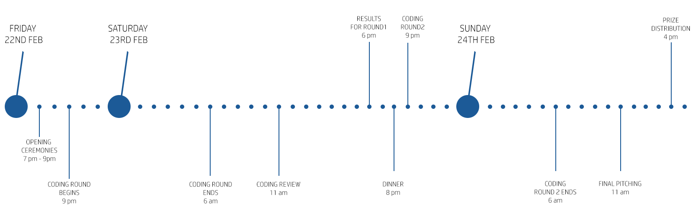

# DEVSOC 2K19 - [CodeChef VIT Chapter](https://www.facebook.com/codechefvituniversity/)

> #### Welcome to [DEVSOC'19](http://www.devsoc-codechef.com/). It is an open hack, a sprint if you must. Hackathon, but just one of its kind!

## Event Flow

## FAQ

    
<strong>What is the venue of the hackathon?</strong>

First Phase of the Hackathon is Online that is Idea submission. Main event which is from 22nd Feb will be conducted in Anna Auditorium, VIT Vellore.

 

    
<strong>What is the cost of the hackathon?</strong>

There is no Registration fee for the Hackathon. It is absolutely free.

   

    
<strong>Is it necessary for whole team to be present all the time?</strong>

No, not necessarily, but at least one member should be present while pitching.

## INR 80, 000 IN PRIZES

- #### First Prize : INR 50, 000
- #### Second Prize : INR 20, 000
- #### Thire Prize : INR 10, 000

### Special Prizes

- Best UI/UX
- Best all women's team

> ### There are swags for all!

## Code Reviewers

- [Siddhartha Gupta](https://github.com/sidd-gupta)
- [Mohammed Sohail](https://github.com/YoursSohail/)
- [Angad Sharma](https://github.com/angadsharma1016)
- [Arjun Agarwal](https://github.com/orgs/CodeChefVIT/people/agarwalarjun123)
- [Vishwam Vyas](https://github.com/VVishvam)
- [Krati Agarwal](https://github.com/kratiagarwal07)
- [Yash Mehrotra](https://github.com/YashMeh)
- [Vinit Shahdeo](https://github.com/vinitshahdeo)

## Documentation
Backend
- [express-generator](https://www.npmjs.com/package/express-generator) 
- [SocketIO](https://socket.io/docs/)
- [PassportOauth2](http://www.passportjs.org/docs/)
- [PyFlask Documentation](http://flask.pocoo.org/docs/1.0/tutorial/)

App Development
- [retrofit](https://square.github.io/retrofit/)
- [volley](https://developer.android.com/training/volley/)
- [fast-Android-Networking](https://github.com/amitshekhariitbhu/Fast-Android-Networking)
- [FireBase Authentication](https://firebase.google.com/docs/auth/android/custom-auth)
- [Flutter](http://flutter.io/docs)

Cloud Services
- [DigitalOcean](http://digitalocean.com/)
- [AWS EC2](https://aws.amazon.com/ec2/)
- [Heroku](https://www.heroku.com/)

Frontend
- [React BoilerPlate](https://github.com/react-boilerplate/react-boilerplate/tree/master/docs) 
- [MaterializeCSS](https://materializecss.com/)

AI and ML
- [Pytorch](https://pytorch.org/docs/stable/index.html)
- [Tensorflow](https://www.tensorflow.org/guide)
- [Keras](https://keras.io/)
- [OpenCV](https://docs.opencv.org/2.4/doc/tutorials/tutorials.html)

 UI and UX Design

MAC
- [Sketch](https://www.sketchapp.com/docs/)

Windows
- [UI Design Kit](https://www.adobe.com/in/products/xd/ui-design-kits.html)
- [Material Design Kit](https://materialdesignkit.com/)
- [Webflow](https://webflow.com/)
- [Google PWA](https://developers.google.com/web/progressive-web-apps/)

## [Public API List](https://github.com/toddmotto/public-apis) !

## Thanks!

**Hope to see you on top!**

